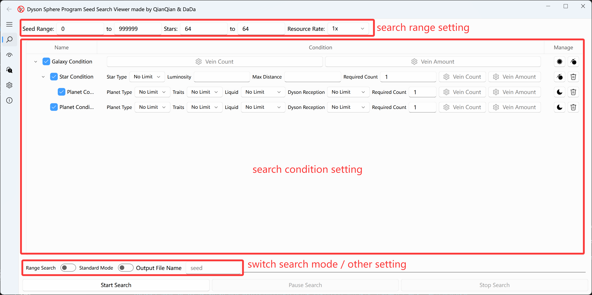
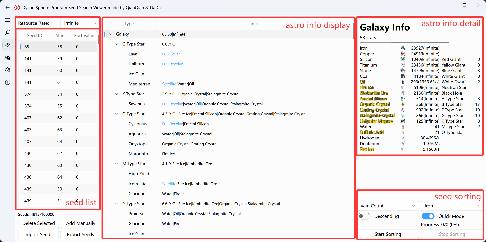
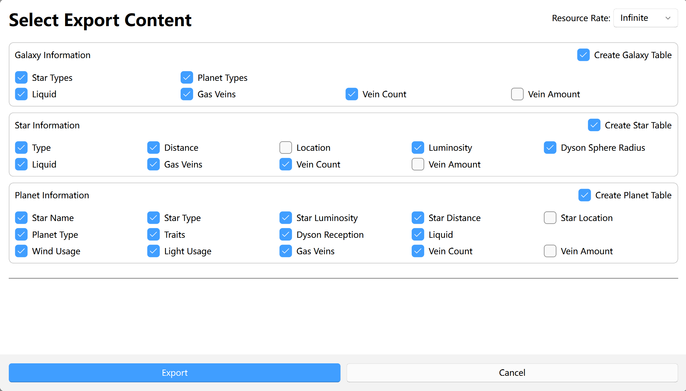
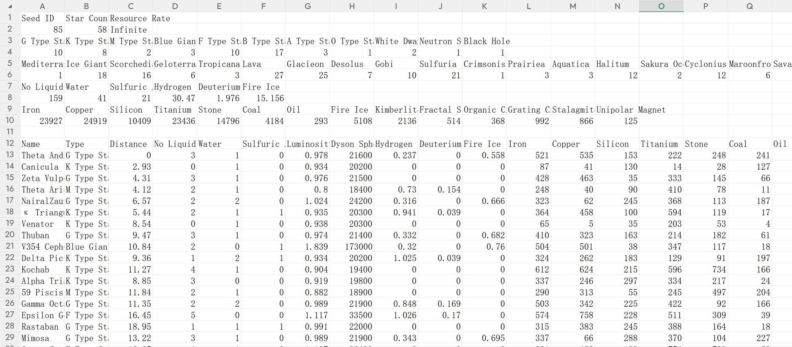
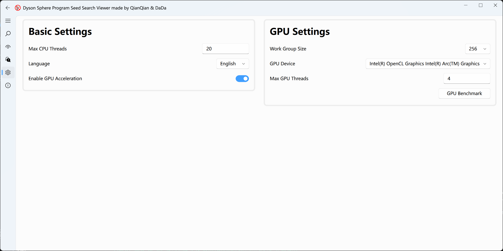

# Dyson Sphere Program Seed Searcher & Viewer Guide
In Dyson Sphere Program, each save's galaxy map is uniquely determined by the seed ID, star count, and resource rate. The resource rate only affects the amount in each vein; it does not affect vein locations or vein counts. Because resource distribution varies enormously between maps, the experience can range from a perfect starting system with a gas giant, two moons, and two rare resources to a cyber prison with only 30 unipolar magnets across the galaxy, no Aquatica, and no Sakura Ocean.

This is why seed searchers exist: they restore the galaxy-generation portion of the game's algorithm to find seeds that meet specific conditions. After multiple versions of updates, this seed searcher is currently the only known tool that perfectly reproduces both vein counts and vein amounts. It also includes built-in features for viewing and exporting seed information.

This project is fully open source. Stars are welcome.

Project repository: [dsp_search_seed](https://github.com/botany233/dsp_search_seed)

## Seed Search Tutorial
### UI
Click the magnifying-glass icon on the left to enter the seed search page. This page is mainly divided into three sections: search range settings, search condition settings, and extra settings. The search range includes both the left and right boundaries.


### Search Condition Types
Each Dyson Sphere Program save is a galaxy. By celestial hierarchy, it can be divided into three levels, galaxy-star-planet, or four levels, galaxy-star-planet-moon.

Similarly, this program divides search conditions into three types: galaxy, star, and planet. A planet condition can add itself as a child condition, corresponding to the four-level celestial hierarchy. The supported search content and notes for the three condition types are listed below:

Galaxy conditions

- Minimum counts for 14 vein types
- Minimum amounts for 14 vein types

Star conditions

- Star type: multiple selection supported
- Minimum luminosity
- Max distance: enter 0 for the initial star system
- Required count: the number of star systems that must satisfy this condition
- Minimum counts for 14 vein types: unipolar magnets only appear around neutron stars and black holes
- Minimum amounts for 14 vein types

Planet conditions

- Planet type: multiple selection supported. Only the initial planet can be Mediterranean.
- Planet traits: also called planet entries; multiple selection supported
- Liquid type
- Dyson Reception: Full Cover, where the whole planet can receive without lenses; Full Receive, where the whole planet can receive with lenses. A galaxy can have at most one Full Cover Planet or two Full Receive Planets.
- Required count: the number of planets that must satisfy this condition
- Minimum counts for 14 vein types
- Minimum amounts for 14 vein types

There is also a special condition type used to check whether the current seed contains enough paired celestial bodies. A Bond Condition has two independent child conditions, which can be star or planet conditions. Each child condition can set a maximum connection count to limit how many celestial bodies from the other group a single celestial body can pair with at most. During search, the searcher first filters two groups of celestial bodies based on the child conditions, then filters all possible pair connections by distance requirements, and finally filters the pair connections by the maximum connection counts of the two celestial body groups. Note that for planet conditions, coordinate information is approximated using the star's coordinates.

### Search Condition Structure
When searching seeds, the searcher starts from the galaxy condition and checks whether the current seed satisfies itself and all of its child conditions. When multiple child conditions exist, the searcher checks them one by one. Child conditions are independent of each other, so the same celestial body can satisfy multiple child conditions. The parent condition is considered satisfied only when all child conditions are satisfied, meaning child conditions are combined with an AND relationship.

The searcher also allows planet conditions to be added directly as child conditions of the galaxy. All possible condition structures are shown below:

```
Galaxy Condition
|-- Star Condition
|   |-- Planet Condition
|   `-- Planet Condition
|       `-- Moon Condition
|-- Planet Condition
|-- Planet Condition
|   `-- Moon Condition
`-- Bond Condition
```

Click the button before a condition name to choose whether to enable the current condition. This does not cascade to its child conditions.

### Saving Search Results
Results are stored as `.csv` files and can be viewed with Excel or WPS. Each row is a seed, including seed ID and star count but not resource rate, and is compatible with [DspFindSeed](https://github.com/Xinyuell/DspFindSeed). The file name can be configured at the bottom. The save location is the program's root directory.

### Range Search / Secondary Search
Range Search mode determines the search range by setting the starting seed ID, ending seed ID, and star count. Secondary Search mode determines the search range by importing a previously saved `.csv` seed list. Secondary Search includes deduplication.

Click the first button in Extra Settings to switch between the two search modes.

### Standard Mode / Quick Mode
In Standard Mode, the calculated vein counts and amounts are kept as consistent with the game as possible, representing this program's highest accuracy. However, fully generating veins has a huge performance cost, so Quick Mode is introduced. In Quick Mode, the calculated vein counts and amounts are theoretical maximum values. The actual vein count averages 78% of that value, and the actual vein amount averages 72% of that value. Quick Mode has roughly consistent performance cost for each seed, while Standard Mode varies greatly. See the Search Performance Optimization section for details.

Click the second button in Extra Settings to switch between the two search accuracy modes.

## Seed Viewer Tutorial
### UI
Click the eye icon on the left to enter the seed viewer page. This page is mainly divided into five sections: resource rate selection, seed list, celestial information display, celestial information details, and seed sorting.


### Resource Rate Selection
This setting affects the resource rate used for generating seed information and sorting seeds in the viewer.

### Seed List
The viewer itself was not designed for extremely large seed volumes, so it has a limit of 100,000 seeds. Click any seed to switch the content shown in the celestial information display. Hold the left mouse button and drag to select multiple seeds for batch deletion or seed information export.

Fully obtaining one seed's information with the CPU takes about 3 to 10 seconds. After enabling GPU acceleration, it usually takes less than 1 second. The program caches information for the 100 most recently clicked seeds. You can click multiple seeds quickly to use multithreading to accelerate generation.

In addition to seed ID and star count, a sort value is provided to evaluate seed value. When exporting a seed list, the sort value is exported as well.

### Celestial Information Display & Details
Click any celestial body in the celestial information display to view its details. Note that after switching the resource rate, the UI will not refresh automatically; you need to click again.

### Seed Sorting
The viewer includes four common seed sorting methods: Vein Count, Vein Amount, Planet Type, and Star Type. It also supports customization with Python code. See [README.md](../README.md) for the detailed tutorial.

The first button switches between ascending and descending sort order. The second button switches between Quick Mode and Standard Mode. Unlike the searcher, the viewer's Standard Mode is not performance-optimized. Sorting requires fully generating all information for every seed. On CPU, it is about 20,000 times slower than Quick Mode, so use it carefully.

Note that High-Yield Gas Giants are treated as Gas Giants when sorting by planet type.

### Exporting Seed Information
After selecting one or more seeds in the seed list, right-click and choose to export seed information. After confirming the content to export, click the export button below and choose an export folder. Each seed generates one **.csv** file, so when exporting many seeds, it is recommended to create a new folder<s> unless you want your desktop buried in files</s>.
<!--  -->


## Settings Tutorial
### UI
Click the gear icon on the left to enter the settings page. This page is divided into two sections: Basic Settings and GPU Settings.


### Basic Settings
Max CPU Threads: controls the maximum number of threads that the searcher and viewer can create at the same time. It can be set up to 128 threads, but the number of threads actually used will not exceed the CPU's logical processor count. The default value is the same as the CPU's logical processor count. Note that with this setting, the UI may freeze during search and sorting. If you care about UI smoothness, reduce this value by 1.

Enable GPU Acceleration: calculating accurate seed mineral counts and amounts requires generating planet terrain. This process is extremely time-consuming, but GPU acceleration can be used. After enabling it, the delay when refreshing seed information in the viewer can be significantly reduced. This program's GPU acceleration depends on OpenCL 3.0, and some ancient GPUs may not support it. Some GPUs do not support double precision, mainly Intel integrated graphics before the Ultra series. In that case, single precision will be used for calculation, but the generated mineral information will differ slightly from double precision. About 10% of seeds will have anomalies on 1 to 2 planets.

### GPU Settings
Work Group Size: increasing this value can slightly improve GPU acceleration performance. Different GPUs support different maximum values. If search or sorting does not work properly, try reducing this value.

GPU Device: currently, the application only supports using at most one GPU. It is recommended to use the highest-performance GPU to improve performance.

Max GPU Threads: manages the maximum number of threads that use GPU acceleration at the same time. You can find the best value through performance testing. It is generally between 2 and 6.

GPU Benchmark: tests how different GPU thread counts affect terrain generation speed under the specified CPU thread count. The default test time for each thread is 1 second, and it can be adjusted as needed.

## Search Performance Optimization
To improve search efficiency, the searcher uses a series of optimizations. Determining whether a seed satisfies the conditions can be divided into two steps: galaxy generation and condition checking. Galaxy generation is the main time cost. During condition checking, a seed can be eliminated as soon as it fails any condition, so not all galaxy information will be used. Therefore, splitting galaxy generation into multiple steps and performing condition checks multiple times can greatly improve search performance.

Currently, galaxy generation is split into four levels: generating star information, generating planet information, generating mineral upper limits, and generating accurate minerals. After each level of information is generated, condition checking is performed once. If a condition uses information that has not yet been generated, that condition is considered passed by default and left for later checking. In Quick Mode, level 4 accurate mineral generation is skipped, and seeds that pass condition checking in the first three levels pass directly.

Because the first three levels are generated quickly, all related information for the seed is generated at once. Level 4 is extremely time-consuming. In addition to using GPU acceleration, accurate minerals can also be generated only for necessary planets. In other words, if a planet's mineral count does not affect the judgment result, it will not be generated.

Specifically, generation is skipped when a planet fails non-mineral condition checks, or when its mineral types do not match the condition requirements for planet and moon conditions, or have no overlap for star and galaxy conditions. Also, after enough celestial bodies have satisfied a condition, checks for subsequent celestial bodies are skipped.

Among these, galaxy-level mineral conditions usually have the most obvious performance impact. If a galaxy condition in Standard Mode requires common minerals with a large value, such as requiring the galaxy to contain 30,000 iron veins, almost every planet will generate accurate minerals, and the performance cost will be close to having no optimization at all. Therefore, common minerals are not recommended in galaxy conditions. Only unipolar magnets and 1 to 2 rare resources are recommended.

## Searcher Performance
The searcher performance table is shown below. All results are for 64-star galaxies:

<table style="width:100%; border-collapse: collapse;">
  <tr class="table-header">
    <th style="border: 1px solid #ddd; padding: 10px; text-align: center;">Performance Table (seed/s)</th>
    <th style="border: 1px solid #ddd; padding: 10px; text-align: center;">Level 1</th>
    <th style="border: 1px solid #ddd; padding: 10px; text-align: center;">Level 2</th>
    <th style="border: 1px solid #ddd; padding: 10px; text-align: center;">Level 3 - Quick</th>
    <th style="border: 1px solid #ddd; padding: 10px; text-align: center;">Level 3 - Standard</th>
    <th style="border: 1px solid #ddd; padding: 10px; text-align: center;">Level 4 - Standard</th>
    <th style="border: 1px solid #ddd; padding: 10px; text-align: center;">Better Starting System - Standard</th>
    <th style="border: 1px solid #ddd; padding: 10px; text-align: center;">All Rares Hard Flight - Standard</th>
    <th style="border: 1px solid #ddd; padding: 10px; text-align: center;">All Rares Magnet - Standard</th>
  </tr>
  <tr>
    <td style="border: 1px solid #ddd; padding: 10px; text-align: center;">CPU(Ultra 7 155H)</td>
    <td style="border: 1px solid #ddd; padding: 10px; text-align: center;">211107</td>
    <td style="border: 1px solid #ddd; padding: 10px; text-align: center;">61689</td>
    <td style="border: 1px solid #ddd; padding: 10px; text-align: center;">57503</td>
    <td style="border: 1px solid #ddd; padding: 10px; text-align: center;">351.6</td>
    <td style="border: 1px solid #ddd; padding: 10px; text-align: center;">1.08</td>
    <td style="border: 1px solid #ddd; padding: 10px; text-align: center;">173111</td>
    <td style="border: 1px solid #ddd; padding: 10px; text-align: center;">173742</td>
    <td style="border: 1px solid #ddd; padding: 10px; text-align: center;">57963</td>
  </tr>
  <tr class="zebra-row">
    <td style="border: 1px solid #ddd; padding: 10px; text-align: center;">Integrated GPU (Arc 128EU)</td>
    <td style="border: 1px solid #ddd; padding: 10px; text-align: center;">209361</td>
    <td style="border: 1px solid #ddd; padding: 10px; text-align: center;">62071</td>
    <td style="border: 1px solid #ddd; padding: 10px; text-align: center;">56214</td>
    <td style="border: 1px solid #ddd; padding: 10px; text-align: center;">719.5</td>
    <td style="border: 1px solid #ddd; padding: 10px; text-align: center;">2.35</td>
    <td style="border: 1px solid #ddd; padding: 10px; text-align: center;">163283</td>
    <td style="border: 1px solid #ddd; padding: 10px; text-align: center;">172023</td>
    <td style="border: 1px solid #ddd; padding: 10px; text-align: center;">61004</td>
  </tr>
  <tr>
    <td style="border: 1px solid #ddd; padding: 10px; text-align: center;">Dedicated GPU (RX 9070)</td>
    <td style="border: 1px solid #ddd; padding: 10px; text-align: center;">205052</td>
    <td style="border: 1px solid #ddd; padding: 10px; text-align: center;">63463</td>
    <td style="border: 1px solid #ddd; padding: 10px; text-align: center;">59208</td>
    <td style="border: 1px solid #ddd; padding: 10px; text-align: center;">2315</td>
    <td style="border: 1px solid #ddd; padding: 10px; text-align: center;">8.13</td>
    <td style="border: 1px solid #ddd; padding: 10px; text-align: center;">170105</td>
    <td style="border: 1px solid #ddd; padding: 10px; text-align: center;">171869</td>
    <td style="border: 1px solid #ddd; padding: 10px; text-align: center;">65358</td>
  </tr>
</table>

- Level 1: Blue Giant x3
- Level 2: Aquatica x6 + Gas Giant with at least 3 satellites x2
- Level 3: Oil x250 + Unipolar Magnet veins x250
- Level 4: Iron veins x30000
- Better Starting System: the initial star system has a Gas Giant, one of its satellites is Mediterranean, and another satellite is Desolus with Stalagmite Crystal and Fire Ice
- All Rares Hard Flight: galaxy Unipolar Magnet veins x80 + Stalagmite Crystal veins x400; within max distance 5, an O Type Star system has a Gas Giant, Tidal Locking, a Full Cover Planet, Water and Sulfuric Acid, and all rare resources except Unipolar Magnet
- All Rares Magnet: galaxy Unipolar Magnet veins x120; an O Type Star system has a High-Yield Gas Giant, a Full Receive Planet, Water and Sulfuric Acid, and all rare resources except Unipolar Magnet, while the nearest Unipolar Magnet planet is within 12 light-years

## Viewer Performance
The viewer sorting performance table is shown below. All results are for 64-star galaxies. Seed information export speed is similar to Standard Mode:

<table style="width:100%; border-collapse: collapse;">
  <tr class="table-header">
    <th style="border: 1px solid #ddd; padding: 10px; text-align: center;">Performance Table (seed/s)</th>
    <th style="border: 1px solid #ddd; padding: 10px; text-align: center;">Quick Mode</th>
    <th style="border: 1px solid #ddd; padding: 10px; text-align: center;">Standard Mode</th>
  </tr>
  <tr>
    <td style="border: 1px solid #ddd; padding: 10px; text-align: center;">CPU(Ultra 7 155H)</td>
    <td style="border: 1px solid #ddd; padding: 10px; text-align: center;">9266</td>
    <td style="border: 1px solid #ddd; padding: 10px; text-align: center;">1.08</td>
  </tr>
  <tr class="zebra-row">
    <td style="border: 1px solid #ddd; padding: 10px; text-align: center;">Integrated GPU (Arc 128EU)</td>
    <td style="border: 1px solid #ddd; padding: 10px; text-align: center;">9266</td>
    <td style="border: 1px solid #ddd; padding: 10px; text-align: center;">2.37</td>
  </tr>
  <tr>
    <td style="border: 1px solid #ddd; padding: 10px; text-align: center;">Dedicated GPU (RX 9070)</td>
    <td style="border: 1px solid #ddd; padding: 10px; text-align: center;">9266</td>
    <td style="border: 1px solid #ddd; padding: 10px; text-align: center;">8.56</td>
  </tr>
</table>
