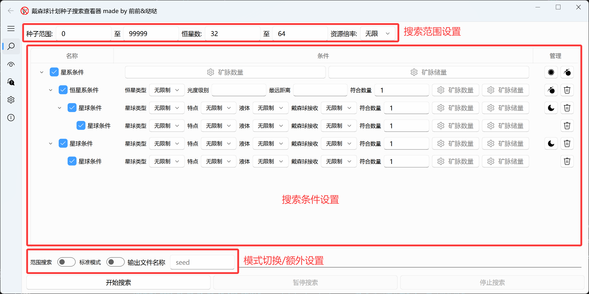
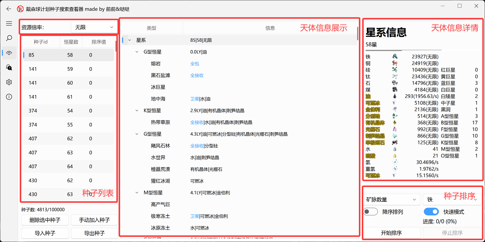
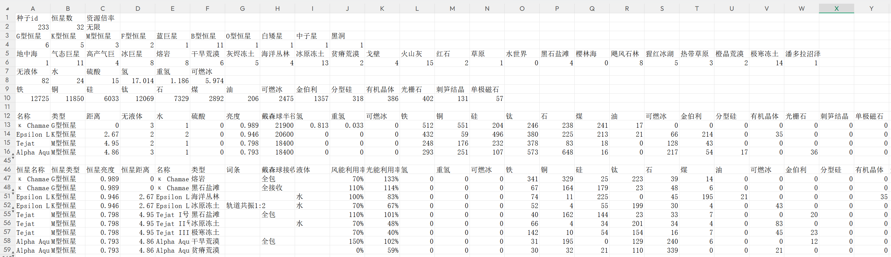
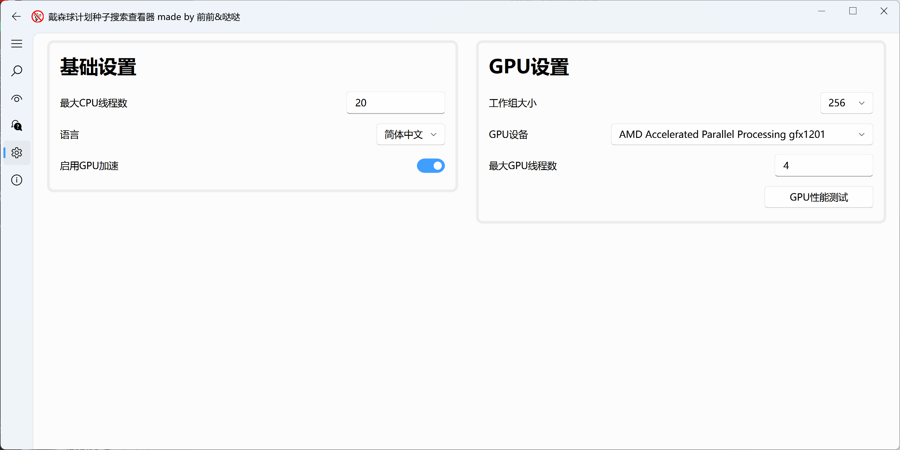

# 戴森球计划种子搜索查看器使用说明
在戴森球计划中，每个存档的星区地图由(种子id，恒星数量，资源倍率)唯一确定。其中资源倍率只影响单个矿脉的储量，不影响矿脉位置和数量。由于不同地图的资源分布差异巨大，上到气巨双卫双珍奇的完美开局，下到全星区30磁石0水世界0樱林海的赛博牢房，二者游戏体验截然不同。

基于此，搜种器应运而生，通过还原游戏算法中星系生成部分，以寻找满足特定条件的种子。本搜种器经过多个版本更新，是目前已知唯一一个实现矿脉数量和矿脉储量完美还原的搜种器。同时内置了种子信息查看和导出的相关功能。

本项目完全开源，欢迎来点个star~

项目仓库：[dsp_search_seed](https://github.com/botany233/dsp_search_seed)

## 种子搜索教程
### UI界面
点击左侧放大镜符号，即可进入种子搜索界面。该界面主要分为搜索范围设置、搜索条件设置、额外设置三个部分。其中搜索范围包括左右边界。


### 搜索条件类型
戴森球计划的每个存档为一个星区，并按天体层次可分为星区-恒星-星球三级，或星区-恒星-行星-卫星四级。

类似的，本程序搜索条件分为星区、恒星、星球三类。其中星球可添加自身作为子条件，此时与四级天体相对应。三类条件支持的搜索内容及注意事项如下：

星区条件

- 14种矿脉最低数量
- 14种矿脉最低储量

恒星条件

- 恒星类型：可多选
- 最低光照
- 最远距离：输入0表示初始恒星系
- 符合数量：需要满足该条件的恒星系数量
- 14种矿脉最低数量：单极磁石仅在中子星和黑洞出现
- 14种矿脉最低储量

星球条件

- 星球类型：可多选，有且仅有初始星球为地中海类型
- 星球特点：即星球词条，可多选
- 液体类型
- 戴森球接收：全包（不使用透镜时全球可暖锅）、全接收（使用透镜时全球可暖锅）。一个恒星系最多只有一个全包星或两个全接收星
- 符合数量：需要满足该条件的行星数量
- 14种矿脉最低数量
- 14种矿脉最低储量

还有一类比较特殊的条件，用于判断当前种子是否存在足够数量的组合星体。绑定条件有两个独立的子条件，可选恒星/星球条件。每个子条件可设置最大连接数，用于限制单个星体最多与多少个另一星体形成组合。搜索时首先根据子条件筛选出两组对应的星体，之后按照距离要求筛选所有可能的连接组合，最后按照两种星体的最大连接数对连接组合进行过滤。注意对于星球条件，坐标信息使用恒星坐标进行近似。

### 搜索条件结构
在搜索种子时，搜索器会从星区条件开始，依次判定当前种子是否满足自身及其所有子条件。当有多个子条件时，搜索器会逐一对子条件进行判定，即子条件间相互独立，同一天体可满足多个子条件。并且需要所有子条件均满足时自身条件才被判定通过，即子条件间为“与”关系。

搜索器还允许直接将星球/行星条件作为星区条件的子条件，所有可能的条件结构如下所示：

```
星区条件
┣ 恒星条件
┃ ┣ 星球条件
┃ ┗ 行星条件
┃   ┗ 卫星条件
┣ 星球条件
┣ 行星条件
┃ ┗ 卫星条件
┗ 绑定条件
```

单击条件名称前的按钮可选择是否启用当前条件，但不连锁至其子条件。

### 搜索结果保存
存储格式为.csv文件，可使用excel或wps进行查看。每行为一个种子，包括种子id和恒星数量，不包括资源倍率，与[DspFindSeed](https://github.com/Xinyuell/DspFindSeed)兼容。文件名称可在下方进行设置。保存位置为本程序根目录。

### 范围搜索/二次搜索
范围搜索模式通过设置起始和中止的种子id、恒星数确定搜索范围。二次搜索模式通过导入之前保存的.csv种子列表确定搜索范围。二次搜索具有去重功能。

点击额外设置中的第一个按钮可以在两种搜索模式中切换。

### 标准模式/快速模式
标准模式下，会确保计算的矿脉数量/储量与游戏中尽可能一致，代表本程序的最高精度。但完整生成矿脉的性能开销较大，因此引入快速模式。在快速模式中，计算的矿脉数量/储量为理论最大值，实际矿脉数量平均为该值的78%，矿脉储量平均为该值的72%。快速模式对每个种子的性能开销基本一致，而标准模式差异较大。

点击额外设置中的第二个按钮可以在两种搜索精度中切换。

## 种子查看教程
### UI界面
点击左侧眼睛符号，即可进入种子查看界面。该界面主要分为资源倍率选择、种子列表、天体信息展示、天体信息详情、种子排序五个部分。


### 资源倍率选择
此设置影响查看器中种子信息生成和种子排序的资源倍率。

### 种子列表
查看器本身设计时并未考虑过大的种子量级，因此设置了10万个种子的上限。点击任意种子即可切换天体信息展示的内容。按住左键+拖拽可以多选种子进行批量删除或种子信息导出。Ctrl + A可以全选。

使用CPU完整获取一个种子信息视线程数不同大约需要1~3秒。启用GPU加速后一般<1秒。程序会缓存最近100个点击的种子信息。

除了种子id和恒星数外，还提供了排序值用来评估种子价值。在导出种子列表时，排序值会被一并导出。

### 天体信息展示&详情
点击天体信息展示中的任意天体即可查看该天体详情。注意当切换资源倍率后，界面不会自动刷新，需重新点击。

### 种子排序
查看器内置了矿脉数量、矿脉储量、行星类别、恒星类别四种常用的种子排序方式，同时可使用python代码进行自定义，具体教程可以参考[README.md](../README.md)。

第一个按钮可以切换升序/降序的排序方式。第二个按钮切换快速模式/标准模式。与搜索器不同的是，查看器标准模式并未进行性能优化，排序时需要完整的生成每个种子的全部信息，CPU下速度较快速模式大约慢3000倍，请谨慎使用。

注意高产气巨在按照星球类别排序时会被视为气态巨星。

### 种子信息导出
在种子列表中单选或多选种子后，右键可选择导出种子信息。确定需要导出的内容后，点击下方导出按钮，选择导出文件夹。每个种子会生成一个**.csv**文件，因此在导出大量种子时，建议新建文件夹<s>（你也不想电脑桌面被文件淹没吧）</s>。


## 设置教程
### UI界面
点击左侧齿轮符号，即可进入设置界面。该界面分为基础设置和GPU设置两个部分。


### 基础设置
最大CPU线程数：控制搜索器和查看器最多同时创建的线程数。最高可设置为128线程，但实际调用的线程数不会超过CPU逻辑处理器数量。默认值与CPU逻辑处理器数量相同，注意此时在搜索和排序时UI界面可能会卡顿，若在意UI流畅性请将该值-1。

启用GPU加速：查看器在计算星球建造面积时需要生成星球地形，该过程极其耗时但可利用GPU加速计算。启用后，可显著降低查看器刷新种子信息时的延迟和排序用时。本程序的GPU加速依赖OpenCL3.0，部分上古GPU可能不支持。某些GPU不支持双精度（主要是Ultra系列前的酷睿核显），此时将使用单精度进行计算，但是生成的矿物信息会与双精度下有小幅差异（大约10%的种子会有1~2个球出现异常）。

### GPU设置
工作组大小：该值对GPU加速的性能影响微乎其微，但不同GPU支持的最大值不同，在无法正常搜索/排序时请尝试减小该值。

GPU设备：目前应用只支持调用最多一块GPU，推荐使用性能最高的GPU以提高性能。

最大GPU线程数：管理最多同时使用GPU加速的线程数，可以通过性能测试找到最优值。核显推荐4~8，独显性能差异较大，可选8~16。

GPU性能测试：测试在指定的CPU线程数下，不同GPU线程数对地形生成速度的影响，默认每个线程测试时间为1s，可酌情修改。

## 搜索器性能
目前搜索器已经不再使用GPU计算。性能表格如下，均为64星情况：

<table style="width:100%; border-collapse: collapse;">
  <tr class="table-header">
    <th style="border: 1px solid #ddd; padding: 10px; text-align: center;">性能表格(seed/s)</th>
    <th style="border: 1px solid #ddd; padding: 10px; text-align: center;">级别1</th>
    <th style="border: 1px solid #ddd; padding: 10px; text-align: center;">级别2</th>
    <th style="border: 1px solid #ddd; padding: 10px; text-align: center;">级别3-快速</th>
    <th style="border: 1px solid #ddd; padding: 10px; text-align: center;">级别3-标准</th>
    <th style="border: 1px solid #ddd; padding: 10px; text-align: center;">级别4-标准</th>
    <th style="border: 1px solid #ddd; padding: 10px; text-align: center;">更好的出生点-标准</th>
    <th style="border: 1px solid #ddd; padding: 10px; text-align: center;">全珍奇硬飞-标准</th>
    <th style="border: 1px solid #ddd; padding: 10px; text-align: center;">全珍奇磁石-标准</th>
  </tr>
  <tr>
    <td style="border: 1px solid #ddd; padding: 10px; text-align: center;">CPU(Ultra 7 155H)</td>
    <td style="border: 1px solid #ddd; padding: 10px; text-align: center;">156977</td>
    <td style="border: 1px solid #ddd; padding: 10px; text-align: center;">55584</td>
    <td style="border: 1px solid #ddd; padding: 10px; text-align: center;">51760</td>
    <td style="border: 1px solid #ddd; padding: 10px; text-align: center;">15786</td>
    <td style="border: 1px solid #ddd; padding: 10px; text-align: center;">76.52</td>
    <td style="border: 1px solid #ddd; padding: 10px; text-align: center;">145663</td>
    <td style="border: 1px solid #ddd; padding: 10px; text-align: center;">144623</td>
    <td style="border: 1px solid #ddd; padding: 10px; text-align: center;">55583</td>
  </tr>
</table>

- 级别1：蓝巨×3
- 级别2：水世界×6 + 具有至少3个卫星的气态巨星×2
- 级别3：油×250 + 磁石矿脉×250
- 级别4：铁矿脉×30000
- 更好的出生点：初始恒星系存在气态巨星且其中一卫星为地中海，另一卫星为有刺笋结晶和可燃冰的贫瘠荒漠
- 全珍奇硬飞：星区磁石矿脉×80 + 刺笋结晶矿脉×400，初始星球5光年内的O型恒星系存在气态巨星、潮汐锁定、全包星、水和硫酸、除磁石外全珍奇
- 全珍奇磁石：星区磁石矿脉x120，某一O型恒星系存在高产气巨、全接收星、水和硫酸、除磁石外全珍奇，同时最近的磁石星球距离小于12光年

## 查看器性能
查看器排序性能表格如下，均为64星情况。种子信息导出速度与标准模式近似：

<table style="width:100%; border-collapse: collapse;">
  <tr class="table-header">
    <th style="border: 1px solid #ddd; padding: 10px; text-align: center;">性能表格(seed/s)</th>
    <th style="border: 1px solid #ddd; padding: 10px; text-align: center;">快速模式</th>
    <th style="border: 1px solid #ddd; padding: 10px; text-align: center;">标准模式</th>
  </tr>
  <tr>
    <td style="border: 1px solid #ddd; padding: 10px; text-align: center;">CPU(Ultra 7 155H)</td>
    <td style="border: 1px solid #ddd; padding: 10px; text-align: center;">9031</td>
    <td style="border: 1px solid #ddd; padding: 10px; text-align: center;">3.77</td>
  </tr>
  <tr class="zebra-row">
    <td style="border: 1px solid #ddd; padding: 10px; text-align: center;">核显(Arc 128EU)</td>
    <td style="border: 1px solid #ddd; padding: 10px; text-align: center;">9031</td>
    <td style="border: 1px solid #ddd; padding: 10px; text-align: center;">6.21</td>
  </tr>
  <tr>
    <td style="border: 1px solid #ddd; padding: 10px; text-align: center;">独显(RX 9070)</td>
    <td style="border: 1px solid #ddd; padding: 10px; text-align: center;">9031</td>
    <td style="border: 1px solid #ddd; padding: 10px; text-align: center;">28.85</td>
  </tr>
</table>
