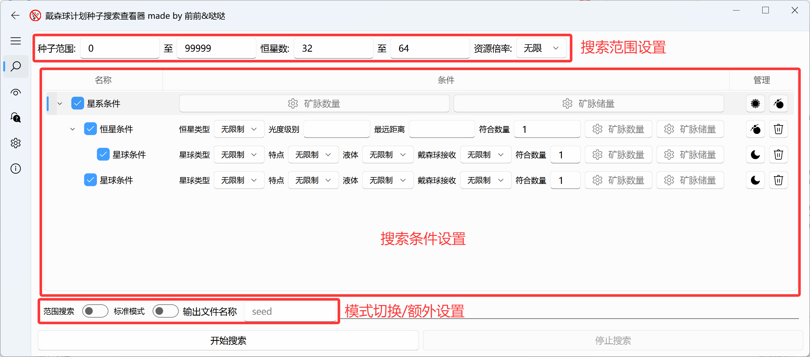
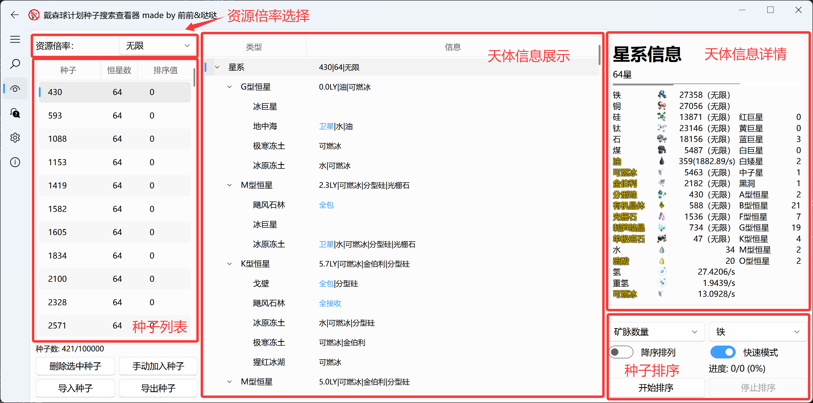
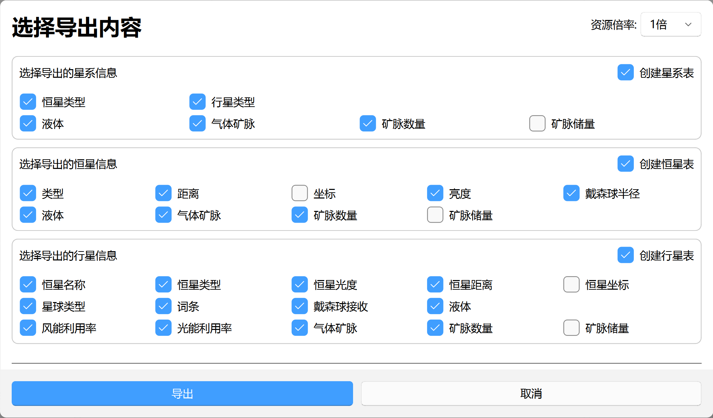
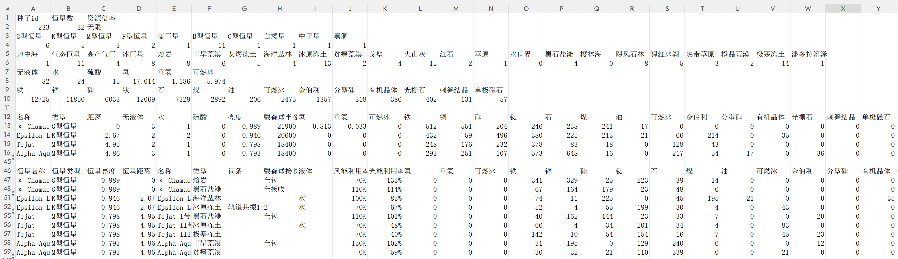
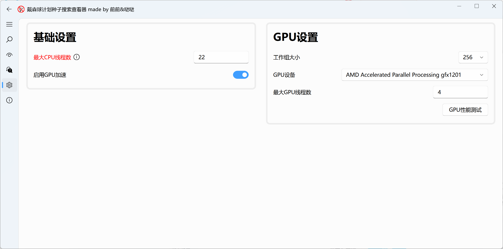

# 戴森球计划种子搜索查看器使用说明
在戴森球计划中，每个存档的星系地图由(种子id，恒星数量，资源倍率)唯一确定。其中资源倍率只影响单个矿脉的储量，不影响矿脉位置和数量。由于不同地图的资源分布差异巨大，上到气巨双卫双珍奇的完美开局，下到全星系30磁石0水世界0樱林海的赛博牢房，二者游戏体验截然不同。

基于此，搜种器应运而生，通过还原游戏算法中星系生成部分，以寻找满足特定条件的种子。本搜种器经过多个版本更新，是目前已知唯一一个实现矿脉数量和矿脉储量完美还原的搜种器。同时内置了种子信息查看和导出的相关功能。

本项目完全开源，欢迎来点个star~

项目仓库：[dsp_search_seed](https://github.com/botany233/dsp_search_seed)

## 种子搜索教程
### UI界面
点击左侧放大镜符号，即可进入种子搜索界面。该界面主要分为搜索范围设置、搜索条件设置、额外设置三个部分。其中搜索范围包括左右边界。


### 搜索条件类型
戴森球计划的每个存档为一个星系，并按天体层次可分为星系-恒星-星球三级，或星系-恒星-行星-卫星四级。

类似的，本程序搜索条件分为星系、恒星、星球三类。其中星球可添加自身作为子条件，此时与四级天体相对应。三类条件支持的搜索内容及注意事项如下：

星系条件
- 14种矿脉最低数量
- 14种矿脉最低储量

恒星条件
- 恒星类型：可多选
- 最低光照
- 最远距离：输入0表示初始恒星系
- 符合数量：需要满足该条件的恒星系数量
- 14种矿脉最低数量：单极磁石仅在中子星和黑洞出现
- 14种矿脉最低储量

星球条件
- 星球类型：可多选，有且仅有初始星球为地中海类型
- 星球特点：即星球词条，可多选
- 液体类型
- 戴森球接收：全包（不使用透镜时全球可暖锅）、全接收（使用透镜时全球可暖锅）。一个星系最多只有一个全包星或两个全接收星
- 符合数量：需要满足该条件的行星数量
- 14种矿脉最低数量
- 14种矿脉最低储量

### 搜索条件结构
在搜索种子时，搜索器会从星系条件开始，依次判定当前种子是否满足自身及其所有子条件。当有多个子条件时，搜索器会逐一对子条件进行判定，即子条件间相互独立，同一天体可满足多个子条件。并且需要所有子条件均满足时自身条件才被判定通过，即子条件间为“与”关系。

搜索器还允许直接将星球/行星条件作为星系的子条件，所有可能的条件结构如下所示：

```
星系条件
┣ 恒星条件
┃ ┣ 星球条件
┃ ┗ 行星条件
┃   ┗ 卫星条件
┣ 星球条件
┗ 行星条件
  ┗ 卫星条件
```

单击条件名称前的按钮可选择是否启用当前条件，但不连锁至其子条件。

### 搜索结果保存
存储格式为.csv文件，可使用excel或wps进行查看。每行为一个种子，包括种子id和恒星数量，不包括资源倍率，与[DspFindSeed](https://github.com/Xinyuell/DspFindSeed)兼容。文件名称可在下方进行设置。保存位置为本程序根目录。

### 范围搜索/二次搜索
范围搜索模式通过设置起始和中止的种子id、恒星数确定搜索范围。二次搜索模式通过导入之前保存的.csv种子列表确定搜索范围。二次搜索具有去重功能。

点击额外设置中的第一个按钮可以在两种搜索模式中切换。

### 标准模式/快速模式
标准模式下，会确保计算的矿脉数量/储量与游戏中尽可能一致，代表本程序的最高精度。但完整生成矿脉的性能开销极大，因此引入快速模式。在快速模式中，计算的矿脉数量/储量为理论最大值，实际矿脉数量平均为该值的78%，矿脉储量平均为该值的72%。快速模式对每个种子的性能开销基本一致，而标准模式差异较大，具体原因请见搜索性能优化章节。

点击额外设置中的第二个按钮可以在两种搜索精度中切换。

## 种子查看教程
### UI界面
点击左侧眼睛符号，即可进入种子查看界面。该界面主要分为资源倍率选择、种子列表、天体信息展示、天体信息详情、种子排序五个部分。


### 资源倍率选择
此设置影响查看器中种子信息生成和种子排序的资源倍率。

### 种子列表
查看器本身设计时并未考虑过大的种子量级，因此设置了10万个种子的上限。点击任意种子即可切换天体信息展示的内容。按住左键+拖拽可以多选种子进行批量删除或种子信息导出。

使用CPU完整获取一个种子信息大约需要3~10秒，启用GPU加速后一般<1秒。程序会缓存最近100个点击的种子信息，可以快速点击多个种子以利用多线程加速生成。

除了种子id和恒星数外，还提供了排序值用来评估种子价值。在导出种子列表时，排序值会被一并导出。

### 天体信息展示&详情
点击天体信息展示中的任意天体即可查看该天体详情。注意当切换资源倍率后，界面不会自动刷新，需重新点击。

### 种子排序
查看器内置了矿脉数量、矿脉储量、行星类别、恒星类别四种常用的种子排序方式，同时可使用python代码进行自定义，具体教程可以参考[README.md](../README.md)。

第一个按钮可以切换升序/降序的排序方式。第二个按钮切换快速模式/标准模式。与搜索器不同的是，查看器标准模式并未进行性能优化，排序时需要完整的生成每个种子的全部信息，CPU下速度较快速模式大约慢2万倍，请谨慎使用。

注意高产气巨在按照星球类别排序时会被视为气态巨星。

### 种子信息导出
在种子列表中单选或多选种子后，右键可选择导出种子信息。确定需要导出的内容后，点击下方导出按钮，选择导出文件夹。每个种子会生成一个**.csv**文件，因此在导出大量种子时，建议新建文件夹<s>（你也不想电脑桌面被文件淹没吧）</s>。
<!--  -->


## 设置教程
### UI界面
点击左侧齿轮符号，即可进入设置界面。该界面分为基础设置和GPU设置两个部分。


### 基础设置
最大CPU线程数：控制搜索器和查看器最多同时创建的线程数。最高可设置为128线程，但实际调用的线程数不会超过CPU逻辑处理器数量。默认值与CPU逻辑处理器数量相同，注意此时在搜索和排序时UI界面可能会卡顿，若在意UI流畅性请将该值-1。

启用GPU加速：在计算种子精确矿物数量/储量时需要生成星球地形，该过程及其耗时但可利用GPU加速计算。启用后，可显著降低查看器刷新种子信息时的延迟。本程序的GPU加速依赖OpenCL3.0，部分上古GPU可能不支持。某些GPU不支持双精度（主要是Ultra系列前的酷睿核显），此时将使用单精度进行计算，但是生成的矿物信息会与双精度下有小幅差异（大约10%的种子会有1~2个球出现异常）。

### GPU设置
工作组大小：提高该值可轻微提高GPU加速时的性能。不同GPU支持的最大值不同，在无法正常搜索/排序时请尝试减小该值。

GPU设备：目前应用只支持调用最多一块GPU，推荐使用性能最高的GPU以提高性能。

最大GPU线程数：管理最多同时使用GPU加速的线程数，可以通过性能测试找到最优值，一般在2~6之间。

GPU性能测试：测试在指定的CPU线程数下，不同GPU线程数对地形生成速度的影响，默认每个线程测试时间为1s，可酌情修改。

## 搜索性能优化

为了提高搜索效率，搜索器采取了一系列的优化措施。判定一个种子是否满足条件可分为星系生成和条件判断两步，其中星系生成为用时大头。考虑到进行条件判断时，不满足任一条件即可剔除该种子，不是所有的星系信息都会被使用到。因此，将星系生成拆分为多步，同时进行多次条件判断能够极大的提高搜索性能。

目前，星系生成被拆分为生成恒星信息、生成星球信息、生成矿物上限、生成精确矿物四个级别。每个级别的信息生成后，都会进行一次条件判定。如果条件中用到了还未生成的信息，则默认该条件通过留待后续检查。在快速模式下，不会进行级别4生成精确矿物的部分，通过前三个级别条件判定的种子将直接通过。

前三个级别由于生成速度较快，将一次性生成该种子所有相关信息。而级别4极其耗时，除了使用GPU加速外，还可以只生成必要星球的精确矿物。即如果该星球的矿物数量不会影响到判断结果，则不进行生成。

具体的，若某星球未通过除矿物外的条件判定或具有的矿物类型与条件要求不符（对行星和卫星条件）/无重叠（对恒星和星系条件），则不进行生成。同时，在已经有足够数量天体满足一个条件后将跳过对后续星体的检查。

其中，星系级矿物条件通常对性能影响最明显。若在标准模式下的星系条件对常见矿物进行要求并且数值较大（比如要求星系包含3万铁矿脉），则几乎每个星球都会生成精确矿物，性能开销接近无任何优化时。因此，不建议星系条件中包含常见矿物，只推荐单极磁石和1~2种稀有资源。

## 搜索器性能
搜索器性能表格如下，均为64星情况：

<table style="width:100%; border-collapse: collapse;">
  <tr class="table-header">
    <th style="border: 1px solid #ddd; padding: 10px; text-align: center;">性能表格(seed/s)</th>
    <th style="border: 1px solid #ddd; padding: 10px; text-align: center;">级别1</th>
    <th style="border: 1px solid #ddd; padding: 10px; text-align: center;">级别2</th>
    <th style="border: 1px solid #ddd; padding: 10px; text-align: center;">级别3-快速</th>
    <th style="border: 1px solid #ddd; padding: 10px; text-align: center;">级别3-标准</th>
    <th style="border: 1px solid #ddd; padding: 10px; text-align: center;">级别4-标准</th>
    <th style="border: 1px solid #ddd; padding: 10px; text-align: center;">更好的出生点-标准</th>
    <th style="border: 1px solid #ddd; padding: 10px; text-align: center;">全珍奇硬飞-标准</th>
  </tr>
  <tr>
    <td style="border: 1px solid #ddd; padding: 10px; text-align: center;">CPU(Ultra 7 155H)</td>
    <td style="border: 1px solid #ddd; padding: 10px; text-align: center;">128843</td>
    <td style="border: 1px solid #ddd; padding: 10px; text-align: center;">40688</td>
    <td style="border: 1px solid #ddd; padding: 10px; text-align: center;">26824</td>
    <td style="border: 1px solid #ddd; padding: 10px; text-align: center;">363.7</td>
    <td style="border: 1px solid #ddd; padding: 10px; text-align: center;">1.10</td>
    <td style="border: 1px solid #ddd; padding: 10px; text-align: center;">41090</td>
    <td style="border: 1px solid #ddd; padding: 10px; text-align: center;">114370</td>
  </tr>
  <tr class="zebra-row">
    <td style="border: 1px solid #ddd; padding: 10px; text-align: center;">核显(Arc 128EU)</td>
    <td style="border: 1px solid #ddd; padding: 10px; text-align: center;">124447</td>
    <td style="border: 1px solid #ddd; padding: 10px; text-align: center;">40542</td>
    <td style="border: 1px solid #ddd; padding: 10px; text-align: center;">26948</td>
    <td style="border: 1px solid #ddd; padding: 10px; text-align: center;">718.5</td>
    <td style="border: 1px solid #ddd; padding: 10px; text-align: center;">2.32</td>
    <td style="border: 1px solid #ddd; padding: 10px; text-align: center;">41134</td>
    <td style="border: 1px solid #ddd; padding: 10px; text-align: center;">111575</td>
  </tr>
  <tr>
    <td style="border: 1px solid #ddd; padding: 10px; text-align: center;">独显(RX 9070)</td>
    <td style="border: 1px solid #ddd; padding: 10px; text-align: center;">123649</td>
    <td style="border: 1px solid #ddd; padding: 10px; text-align: center;">39702</td>
    <td style="border: 1px solid #ddd; padding: 10px; text-align: center;">27099</td>
    <td style="border: 1px solid #ddd; padding: 10px; text-align: center;">1440</td>
    <td style="border: 1px solid #ddd; padding: 10px; text-align: center;">4.48</td>
    <td style="border: 1px solid #ddd; padding: 10px; text-align: center;">41646</td>
    <td style="border: 1px solid #ddd; padding: 10px; text-align: center;">114068</td>
  </tr>
</table>

- 级别1：蓝巨×3
- 级别2：水世界×6 + 具有至少3个卫星的气态巨星×2
- 级别3：油×250 + 磁石矿脉×250
- 级别4：铁矿脉×30000
- 更好的出生点：初始恒星系存在冰巨星且其中一卫星为地中海，另一卫星为有刺笋结晶的贫瘠荒漠
- 全珍奇硬飞：星系磁石矿脉×80 + 刺笋结晶矿脉×400，最远距离为5的O型恒星系存在气态巨星、潮汐锁定、全包星、水和硫酸、除磁石外全珍奇

## 查看器性能
查看器排序性能表格如下，均为64星情况。种子信息导出速度与标准模式近似：

<table style="width:100%; border-collapse: collapse;">
  <tr class="table-header">
    <th style="border: 1px solid #ddd; padding: 10px; text-align: center;">性能表格(seed/s)</th>
    <th style="border: 1px solid #ddd; padding: 10px; text-align: center;">快速模式</th>
    <th style="border: 1px solid #ddd; padding: 10px; text-align: center;">标准模式</th>
  </tr>
  <tr>
    <td style="border: 1px solid #ddd; padding: 10px; text-align: center;">CPU(Ultra 7 155H)</td>
    <td style="border: 1px solid #ddd; padding: 10px; text-align: center;">7878</td>
    <td style="border: 1px solid #ddd; padding: 10px; text-align: center;">1.11</td>
  </tr>
  <tr class="zebra-row">
    <td style="border: 1px solid #ddd; padding: 10px; text-align: center;">核显(Arc 128EU)</td>
    <td style="border: 1px solid #ddd; padding: 10px; text-align: center;">7878</td>
    <td style="border: 1px solid #ddd; padding: 10px; text-align: center;">2.09</td>
  </tr>
  <tr>
    <td style="border: 1px solid #ddd; padding: 10px; text-align: center;">独显(RX 9070)</td>
    <td style="border: 1px solid #ddd; padding: 10px; text-align: center;">7878</td>
    <td style="border: 1px solid #ddd; padding: 10px; text-align: center;">5.29</td>
  </tr>
</table>
