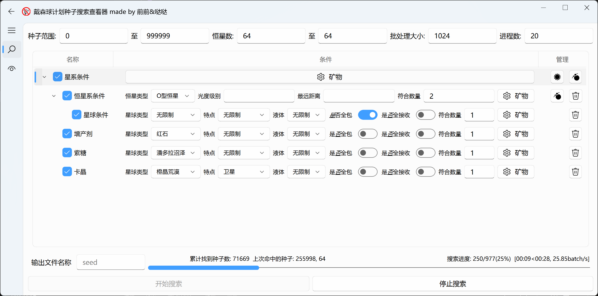
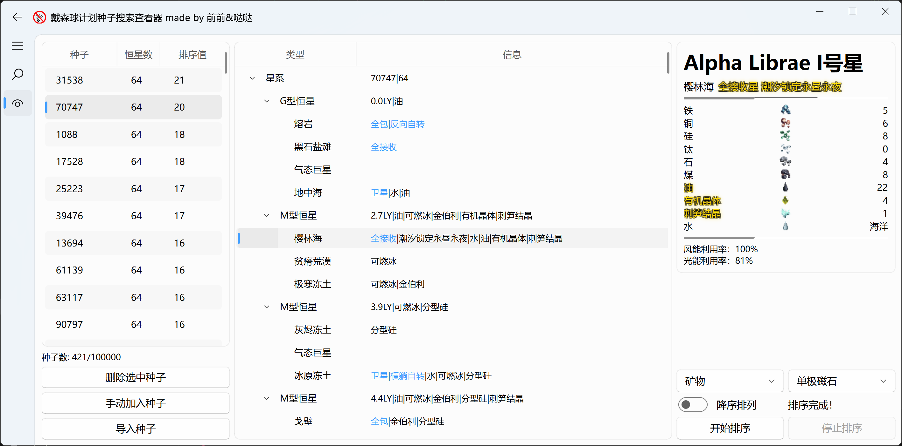

# 戴森球计划种子搜索查看器使用说明&注意事项

## 通用
- 进程安全：由于使用了多进程，建议停止搜索/排序后再退出应用，视批大小有一定的时间延迟，若遇到孤儿进程请使用任务管理器手动结束
- 矿簇/矿脉：矿簇对应游戏中集中的一片矿脉
- 特殊条件：在种子搜索和查看器排序时，高产气巨可被视为气态巨星，但气态巨星不会被视为高产气巨
- 标准模式/快速模式：标准模式下，会确保计算的矿簇/矿脉数量与游戏中尽可能一致，代表本工具的最高精度。但完整生成矿脉的性能开销极大，因此引入快速模式。在该模式中，使用的矿簇和矿脉为理论生成的最大值，实际生成数量大约为该值的**0.8**倍。快速模式对每个种子的性能开销基本一致

## 搜索器
- 搜索条件：搜索器条件分为星系、恒星、星球三级，星系条件可添加恒星/星球条件作为子条件，恒星条件可添加星球条件作为子条件。条件需满足自身及其所有子条件才被判定为满足，满足星系条件的种子将判定为合格并被记录。条件的勾选仅控制自身是否生效，不连锁至其子条件
- 范围搜素/二次搜素：范围搜索根据设定搜索的种子id和恒星数范围进行遍历，二次搜索根据导入的csv文件进行遍历。二次搜索会自动对导入的种子去重
- 批大小：指每个batch中包含的种子数量。由于搜索器会先遍历种子id，再遍历恒星数，同一批大小在搜索单32星和32~64星时对应的计算量截然不同。建议控制每秒完成的batch数量在进程数的**0.5~5**倍之间。过大的批大小会显著增加停止搜索的响应延迟，过小的批大小会带来额外的性能损耗。标准模式下，搜索32~64星建议**≤32**，搜索单个星建议**≤128**；快速模式下，搜索32~64星建议**≤256**，搜索单个星建议**≤1024**
- 进程数：最高可设置为**128**进程，但实际的进程数量不会超过cpu核心数
- 条件优化：对于未设置的条件，搜索时会自动跳过以提高性能，建议不要设置任何多余条件
- 快速模式性能：受搜索条件影响，标准模式比快速模式慢约**1~20000**倍。建议不要在标准模式设置除单极磁石外的星系级别矿簇/矿脉条件以提高性能，这种情况下，标准模式比快速模式慢约**1~100**倍
- 存储格式：为**.csv**文件，每行为一个种子，"**种子id, 恒星数量**"，与[DspFindSeed](https://github.com/Xinyuell/DspFindSeed)兼容

## 查看器
- 种子列表：导入种子上限为10万个，有去重功能
- 刷新延时：完整获取一个种子信息大约需要**3~10**秒，因此在点击种子列表后会延时一段时间才能显示相关信息。您可以快速点击多个种子以同时加载，但加载的进程数同样不会多于cpu核心数。程序会缓存最近**100**个点击的种子信息，因此重复浏览一个种子无需多次等待加载
- 快速模式性能：标准模式排序速度比快速模式慢约**20000**倍

## 支持的搜索条件
- 星系级：
  - 14种矿簇最低数量：一个种子最高26簇单极磁石
  - 14种矿脉最低数量
- 恒星级：
  - 恒星类型
  - 最低光照
  - 最远距离：输入0表示初始恒星系
  - 符合数量：需要满足该条件的恒星/恒星系数量
  - 14种矿簇最低数量：单极磁石仅在中子星和黑洞出现
  - 14种矿脉最低数量
- 星球级：
  - 星球类型：有且仅有初始星球为地中海类型
  - 星球特点：即星球词条，其中多卫星词条只出现在气态行星（气态巨星、冰巨星、高产气巨），卫星词条不会出现在气态行星
  - 液体
  - 全包：不使用透镜时全球可接收，一个星系最多只有一个全包星
  - 全接收：使用透镜时全球可接收，一个星系最多只有两个全接收星
  - 符合数量：需要满足该条件的行星数量
  - 14种矿簇最低数量
  - 14种矿脉最低数量

## 搜索条件优化的额外说明
&nbsp;&nbsp;&nbsp;&nbsp;本模块主要通过解释搜索器的种子判定机制来说明标准模式下不同条件的搜索时间为何差异极大，并给出优化搜索条件的相关思路。

&nbsp;&nbsp;&nbsp;&nbsp;判定一个种子是否满足条件可分为星系生成和条件判断两步，其中生成星球矿物（无论是生成上限还是精确生成）占据了大量的性能。但在进行条件判断时，不是所有的星系信息都会被使用，大部分种子都因为矿物外的条件被剔除。因此，将星系生成拆分为多步，同时进行多次条件判断能够极大的提高搜索性能。

&nbsp;&nbsp;&nbsp;&nbsp;目前，星系生成被拆分为生成恒星/星球信息、生成星球矿物上限、生成精确矿物三步，每一次生成后，都会进行一次条件判定，其中第一次判定时因为没有矿物信息将忽略矿簇/矿脉条件。同时，若搜索条件无矿簇/矿脉要求，将只进行第一轮生成和判定。而在快速模式下，不会进行第三轮生成与判定。

&nbsp;&nbsp;&nbsp;&nbsp;但在标准模式中，生成精确矿物依然占据了超过了**90%**的搜索时长。主要是需要生成星球地形以剔除在地下的矿脉，而地形生成包括一个**161604**次的大循环。虽然每次循环相互独立可并行计算，但在多进程下，已无空余的cpu资源，无法进一步优化~（快来个大佬写个用GPU的吧）~。只能依照同样的思路，如果该星球的矿物数量不会影响到判断结果，则不进行生成。满足以下任一条件的星球将会生成精确矿物：

- 该星球使用矿物上限通过了某一包含矿簇/矿脉的星球条件筛选
- 该星球所属的恒星系使用矿物上限通过了某一包含矿簇/矿脉的恒星条件筛选，并且该星球的矿物上限中包含要求的矿簇/矿脉类型
- 星系条件包含矿簇/矿脉，并且该星球的矿物上限中包含要求的矿簇/矿脉类型

&nbsp;&nbsp;&nbsp;&nbsp;其中，第三条可能覆盖的星球数量最大，对性能影响也最明显。若在标准模式下的星系条件对常见矿物进行要求，则几乎每个星球都会生成精确矿物，性能开销接近无任何优化时。

&nbsp;&nbsp;&nbsp;&nbsp;因此，做出以下建议：

- 星系条件中尽量只包含单极磁石的矿物条件，最多再包含**1~2**种稀有资源
- 减少使用矿物条件判定的恒星/星球数量，可以通过增加其它条件来减少需要生成精确矿物的范围
